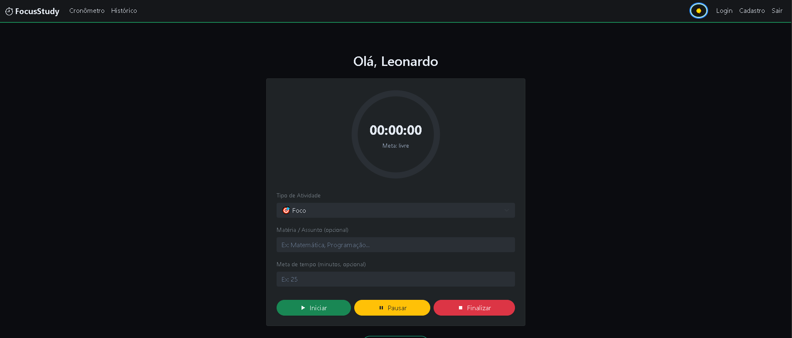

# 🚀 Portfólio Leonardo Cadena

Um portfólio web moderno, responsivo e interativo desenvolvido com **HTML5**, **CSS3** e **JavaScript vanilla**. Apresenta projetos profissionais, experiências e habilidades de um Desenvolvedor Web Júnior.


## 📋 Conteúdo

- [Características](#características)
- [Seções do Portfólio](#seções-do-portfólio)
- [Tecnologias Utilizadas](#tecnologias-utilizadas)
- [Estrutura do Projeto](#estrutura-do-projeto)
- [Funcionalidades](#funcionalidades)
- [Como Usar](#como-usar)
- [Recursos](#recursos)
- [Autor](#autor)
- [Contato](#contato)

## ✨ Características

- ✅ **Design Responsivo** - Adaptação perfeita para mobile, tablet e desktop
- 🌙 **Tema Dark/Light** - Alternância entre modos claro e escuro com persistência
- 🎨 **Interface Moderna** - Design limpo e profissional com uso de CSS Grid e Flexbox
- ⚡ **Sem Dependências Externas** - 100% vanilla JavaScript, sem frameworks
- 📱 **Mobile First** - Desenvolvido com metodologia mobile-first
- 🎯 **Animações Suaves** - Transições e animações CSS para melhor UX
- ♿ **Acessível** - Estrutura semântica HTML5 com boas práticas de acessibilidade
- 🚀 **Performance** - Otimizado para carregamento rápido

## 📑 Seções do Portfólio

### 🏠 **Home (Hero)**
Seção inicial com:
- Boas-vindas personalizadas
- Imagem de perfil circular
- Dois botões de CTA (Call-to-Action)
- Animação de entrada

### 👤 **Sobre**
Apresentação profissional com:
- Biografia detalhada
- Informações de contato (localização, telefone, email)
- Formação acadêmica (FIAP - Análise e Desenvolvimento de Sistemas)
- Resumo de competências e atitudes

### 💼 **Experiência Profissional**
Timeline com histórico profissional:
- **Desenvolvedor Web Júnior** (ago/2025 - nov/2025) - Vox Soluções em TI
  - Desenvolvimento de aplicações web fullstack
  - Trabalho com ASP.NET, Vue.js e bancos de dados SQL
  - 4 meses de experiência prática
  
- **Estagiário de Desenvolvimento Web** (fev/2025 - ago/2025) - Vox Soluções em TI
  - Desenvolvimento e evolução de aplicações web
  - Integração com APIs REST e Elasticsearch
  - 7 meses de aprendizado intensivo

### 📦 **Projetos**
Apresentação de 4 projetos principais:

#### 1. **NutriBreak API**
Plataforma de saúde no trabalho com pausas inteligentes
- Stack: .NET 8, ASP.NET Core, SQL Server, OpenTelemetry
- Recomendações inteligentes baseadas em humor e energia
- [GitHub](https://github.com/cadenasza/NutriBreak)

#### 2. **Pokedex**
Enciclopédia Pokémon interativa
- Stack: HTML5, CSS3, JavaScript, PokeAPI
- Mobile First com Grid Layout responsivo
- Consumo de API REST
- [GitHub](https://github.com/cadenasza/dio-pokedex)

#### 3. **FocusStudy**
Aplicação web em ASP.NET Core para ajudar estudantes a manter o foco
- Stack: .NET 8, ASP.NET Core MVC, EF Core (MySQL), Bootstrap 5, JavaScript
- Cronômetro com meta + progresso circular, badges de atividade, histórico por usuário e dark mode



#### 4. **MaisAbrigo API**
Sistema de gerenciamento de abrigos em emergências com IoT
- Stack: ASP.NET Core, Oracle, Node-RED, Arduino
- Sensores IoT para monitoramento em tempo real
- Dashboard para Defesa Civil
- [GitHub](https://github.com/cadenasza/MaisAbrigo)

### 🛠️ **Skills (Habilidades)**
Categorias de competências:
- **Back-End**: C#, ASP.NET, APIs REST, SQL, Python
- **Front-End**: JavaScript, Vue.js, HTML5, CSS3, Bootstrap
- **Ferramentas & Outros**: Git & GitHub, Elasticsearch, VS Code, Excel, Inglês Intermediário
- **Soft Skills**: Resolução de Problemas, Trabalho em Equipe, Adaptabilidade, Proatividade

### 📧 **Contato**
Seção com:
- Formulário de contato com validação
- Links de redes sociais:
  - LinkedIn
  - GitHub
  - WhatsApp
  - Email

## 🛠️ Tecnologias Utilizadas

### Frontend
- **HTML5** - Estrutura semântica e semanticamente correta
- **CSS3** - Estilização com Grid, Flexbox e variáveis CSS
- **JavaScript (Vanilla)** - Interatividade sem dependências
- **LocalStorage** - Persistência de preferências (tema)

### Características de Código
- CSS Grid e Flexbox para layouts responsivos
- CSS Custom Properties (variáveis) para temas
- Intersection Observer para animações ao scroll
- Event Listeners para interatividade
- Fetch API pronto para futuras integrações

## 📁 Estrutura do Projeto

```
Port/
├── index.html           # Arquivo principal HTML
├── styles.css           # Estilos CSS completos
├── script.js            # Lógica JavaScript
├── README.md            # Este arquivo
└── img/                 # Pasta de imagens
    ├── leo-12.jpeg      # Foto de perfil
    ├── NutriBreak.JPG   # Logo do projeto
  ├── focusStudy.PNG   # Imagem do projeto
    └── api.png          # Logo do projeto
```

## 🚀 Funcionalidades

### 🌙 **Alternância de Tema**
- Toggle button no navbar para alternar entre dark e light mode
- Persistência do tema no localStorage
- Mudança de ícone (🌙 / ☀️) conforme o tema

### 📱 **Responsividade**
- Breakpoints: 768px (tablet), 480px (mobile)
- Grid layouts adaptativos
- Navegação otimizada para todos os dispositivos

### 🎬 **Animações**
- Fade-in ao carregar página
- Scroll animations com IntersectionObserver
- Hover effects em cards e botões
- Animações suaves em transições

### 🔧 **Modais Interativos**
- Modais com conteúdo detalhado dos projetos
- Fechamento por ESC, clique na sobreposição ou botão X
- Prevenção de scroll quando modal aberto

### ✔️ **Validação de Formulário**
- Verificação de campos obrigatórios
- Feedback visual (borda vermelha/verde)
- Alerta de sucesso ao enviar

### 🔝 **Botão Voltar ao Topo**
- Aparece após 300px de scroll
- Smooth scroll animado
- Posicionamento fixo na tela

## 💻 Como Usar

### Opção 1: Localmente
1. Clone ou baixe o repositório
```bash
git clone https://github.com/cadenasza/Port.git
```

2. Abra o arquivo `index.html` diretamente no navegador ou use um servidor local:
```bash
python -m http.server 8000
```

3. Acesse `http://localhost:8000` no navegador

### Opção 2: Online
- Hospede os arquivos em qualquer servidor web estático
- Vercel: https://portfolioweb-beta-plum.vercel.app/

## 📚 Recursos

### Cores Utilizadas
- **Modo Claro**: Preto (#000000) em branco (#ffffff)
- **Modo Escuro**: Branco (#ffffff) em preto (#000000)
- **Acentos**: Tons de cinza (#1a1a1a, #2a2a2a, #cccccc)

### Tipografia
- Font System: Sistema de fontes padrão do navegador (font stack)
- Tamanhos responsivos com clamp()

### Espaçamento
- Base: 1rem (16px)
- Padding padrão: 2rem, 2.5rem
- Gap em grids: 2.5rem, 3rem

## 🎓 Conceitos Aplicados

- ✅ Responsive Web Design
- ✅ CSS Custom Properties (Temas)
- ✅ CSS Grid e Flexbox
- ✅ Mobile First Approach
- ✅ Progressive Enhancement
- ✅ Semantic HTML5
- ✅ DOM Manipulation
- ✅ Event Handling
- ✅ LocalStorage API
- ✅ Intersection Observer API
- ✅ Smooth Scrolling
- ✅ Form Validation

## 👨‍💻 Autor

**Leonardo Cadena**
- 🎓 Desenvolvedor Web Júnior
- 📍 São Paulo, SP - Brasil
- 🎯 Formado em Análise e Desenvolvimento de Sistemas pela FIAP

## 📞 Contato

- **Email**: leonardocadenasza@gmail.com
- **LinkedIn**: [leonardo-cadena](https://www.linkedin.com/in/leonardo-cadena)
- **GitHub**: [cadenasza](https://github.com/cadenasza)
- **WhatsApp**: [+55 11 93383-9709](https://wa.me/5511933839709)
- **Telefone**: (11) 93383-9709

## 📝 Notas

Este portfólio foi desenvolvido como uma demonstração de habilidades em desenvolvimento web frontend, seguindo as melhores práticas de:
- Estrutura HTML semântica
- Estilização CSS moderna
- Interatividade com JavaScript vanilla
- Design responsivo e acessível
- User Experience (UX) intuitiva

## 🔄 Atualizações Futuras

Planejado para versões futuras:
- [ ] Integração com backend para envio de emails
- [ ] Seção de certificados
- [ ] Blog ou artigos técnicos
- [ ] Dashboard de visualizações
- [ ] Suporte para múltiplos idiomas
- [ ] PWA (Progressive Web App)

## 📄 Licença

Este projeto está disponível sob a licença MIT. Sinta-se livre para usar, modificar e distribuir.

---

<div align="center">

**Desenvolvido com ❤️ por Leonardo Cadena**

⭐ Se gostou do projeto, deixe uma estrela!

</div>
